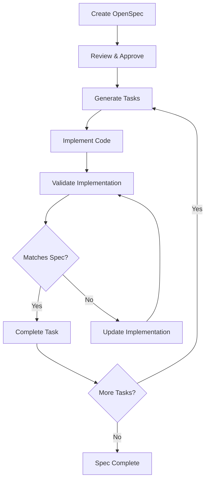
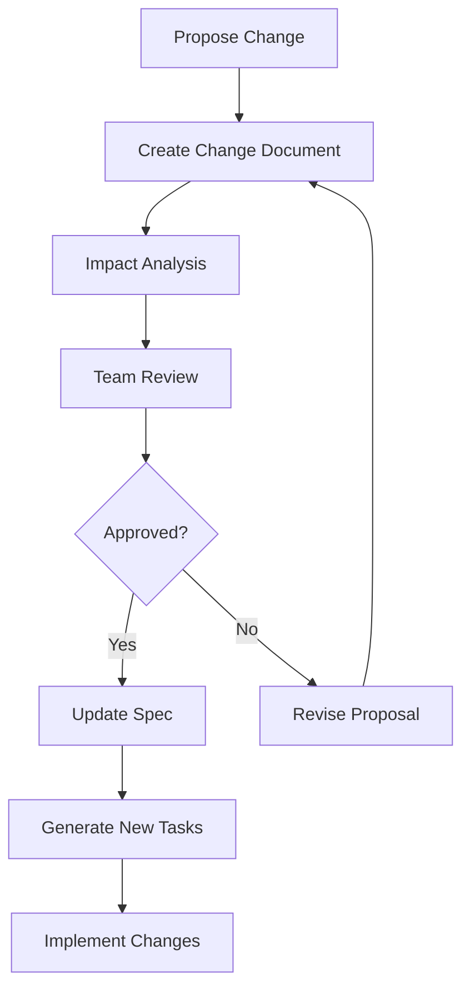

# OpenSpec Integration for Lattice Engine

## Overview
This document outlines the integration of OpenSpec (Fission-AI's spec-driven development framework) into the Lattice Engine, enabling structured specification workflows that align humans and AI coding assistants before any code is written.

## Motivation
- **Spec-Driven Development**: <mcreference link="https://github.com/Fission-AI/OpenSpec" index="1">1</mcreference> Implement OpenSpec's approach where specifications become executable and directly generate working implementations
- **Human-AI Alignment**: <mcreference link="https://github.com/Fission-AI/OpenSpec" index="1">1</mcreference> Ensure human and AI stakeholders agree on specs before work begins
- **Deterministic Outputs**: <mcreference link="https://github.com/Fission-AI/OpenSpec" index="1">1</mcreference> Lock intent before implementation for reviewable, predictable results
- **Structured Change Management**: <mcreference link="https://github.com/Fission-AI/OpenSpec" index="1">1</mcreference> Keep scope explicit and auditable through structured change folders

## Core Features

### 1. OpenSpec Workflow Integration
- **Specification-First Development**: <mcreference link="https://github.blog/ai-and-ml/generative-ai/spec-driven-development-with-ai-get-started-with-a-new-open-source-toolkit/" index="2">2</mcreference> Start with specifications as contracts for code behavior before implementation
- **Structured Change Folders**: <mcreference link="https://github.com/Fission-AI/OpenSpec" index="1">1</mcreference> Organize proposals, tasks, and spec updates in auditable change directories
- **Iterative Spec Evolution**: <mcreference link="https://github.blog/ai-and-ml/generative-ai/spec-driven-development-with-ai-get-started-with-a-new-open-source-toolkit/" index="2">2</mcreference> Update specs and regenerate plans dynamically as requirements evolve
- **Task Decomposition**: <mcreference link="https://github.blog/ai-and-ml/generative-ai/spec-driven-development-with-ai-get-started-with-a-new-open-source-toolkit/" index="2">2</mcreference> Generate small, reviewable chunks that solve specific pieces in isolation

### 2. Lattice Engine Integration
- **Agent-Driven Spec Processing**: Leverage existing Lattice agents to interpret and execute OpenSpec workflows
- **Graph-Based Spec Relationships**: Model spec dependencies and changes in the existing graph infrastructure
- **Mutation Engine Compatibility**: Integrate spec-driven mutations with the existing mutation engine
- **Validation Framework**: Use existing validation agents to ensure spec compliance

### 3. Structured Development Process
- **Spec Definition**: Define clear specifications before code generation
- **Task Generation**: <mcreference link="https://github.blog/ai-and-ml/generative-ai/spec-driven-development-with-ai-get-started-with-a-new-open-source-toolkit/" index="2">2</mcreference> Break down specs into implementable, testable tasks
- **Code Generation**: Generate code that adheres to predefined specifications
- **Validation & Testing**: Validate implementations against original specifications

## Implementation Architecture

### OpenSpec Agent Integration
```python
class OpenSpecAgent(BaseAgent):
    """Agent responsible for OpenSpec workflow management and execution"""
    
    def parse_spec(self, spec_path: str) -> SpecDocument:
        """Parse OpenSpec specification documents"""
        pass
    
    def generate_tasks(self, spec: SpecDocument) -> List[Task]:
        """Generate implementable tasks from specifications"""
        pass
    
    def validate_implementation(self, task: Task, implementation: str) -> ValidationResult:
        """Validate implementation against original specification"""
        pass
    
    def update_spec(self, changes: List[SpecChange]) -> SpecDocument:
        """Update specifications based on change proposals"""
        pass
```

### Spec Graph Integration
- **Specification Nodes**: <mcreference link="https://www.reddit.com/r/cursor/comments/1nomd8t/specdriven_development_is_underhyped_heres_how/" index="3">3</mcreference> Represent specs and their relationships in the graph structure
- **Change Tracking**: <mcreference link="https://www.reddit.com/r/cursor/comments/1nomd8t/specdriven_development_is_underhyped_heres_how/" index="3">3</mcreference> Track how changes to one spec affect related specifications
- **Dependency Management**: Model dependencies between specifications and implementations
- **Version Control**: Maintain spec version history and change auditing

### Mutation Engine Integration
- **Spec-Driven Mutations**: Generate code mutations based on specification changes
- **Impact Analysis**: Analyze how spec changes affect existing implementations
- **Rollback Capabilities**: Revert to previous spec versions when needed
- **Conflict Resolution**: Handle conflicts between spec changes and existing code

## Technical Components

### 1. OpenSpec Directory Structure
```
.openspec/
├── specs/                    # Core specifications
│   ├── feature-name/
│   │   ├── spec.md          # Main specification document
│   │   ├── tasks.md         # Generated task breakdown
│   │   └── acceptance.md    # Acceptance criteria
├── changes/                  # Change proposals
│   ├── change-id/
│   │   ├── proposal.md      # Change proposal
│   │   ├── specs/           # Updated specifications
│   │   └── tasks.md         # Implementation tasks
└── config/
    ├── agents.md            # Agent configuration
    └── constitution.md      # Project principles
```

### 2. Specification Parser
```python
class SpecParser:
    def parse_spec_document(self, spec_path: str) -> SpecDocument:
        """Parse OpenSpec markdown documents into structured data"""
        pass
    
    def extract_requirements(self, spec: SpecDocument) -> List[Requirement]:
        """Extract requirements from specification"""
        pass
    
    def generate_acceptance_criteria(self, spec: SpecDocument) -> List[AcceptanceCriteria]:
        """Generate testable acceptance criteria"""
        pass
```

### 3. Task Generator
```python
class TaskGenerator:
    def decompose_spec(self, spec: SpecDocument) -> List[Task]:
        """Break down specifications into implementable tasks"""
        pass
    
    def prioritize_tasks(self, tasks: List[Task]) -> List[Task]:
        """Prioritize tasks based on dependencies and complexity"""
        pass
    
    def validate_task_completeness(self, tasks: List[Task], spec: SpecDocument) -> bool:
        """Ensure tasks cover all specification requirements"""
        pass
```

## Integration Points

### 1. Lattice Portal Integration
- **Spec Management Interface**: Visual interface for creating and managing OpenSpec documents
- **Change Proposal Workflow**: UI for proposing, reviewing, and approving spec changes
- **Task Tracking Dashboard**: Monitor progress of spec-driven development tasks
- **Collaboration Tools**: Enable team collaboration on specifications and reviews

### 2. VS Code Extension Integration
- **OpenSpec File Support**: Syntax highlighting and validation for OpenSpec markdown files
- **Spec Navigation**: Quick navigation between related specs, tasks, and implementations
- **Change Proposal Creation**: Generate change proposals directly from the editor
- **Task Integration**: Link code changes to specific OpenSpec tasks

### 3. CI/CD Integration
- **Spec Validation**: Validate specifications before merging changes
- **Implementation Verification**: Ensure implementations match their specifications
- **Change Impact Analysis**: Analyze the impact of spec changes on existing code
- **Automated Task Generation**: Generate implementation tasks from approved specs

## Configuration

### Project Configuration
```yaml
# .lattice/openspec.yml
openspec:
  version: "1.0.0"
  
  structure:
    specs_dir: ".openspec/specs"
    changes_dir: ".openspec/changes"
    config_dir: ".openspec/config"
    
  workflow:
    require_approval: true
    auto_generate_tasks: true
    validate_implementations: true
    
  agents:
    spec_parser: "OpenSpecAgent"
    task_generator: "TaskGeneratorAgent"
    validator: "SpecValidatorAgent"
    
  integration:
    portal_enabled: true
    vscode_extension: true
    ci_cd_hooks: true
```

### Agent Configuration
```python
OPENSPEC_AGENT_CONFIG = {
    "parsers": {
        "markdown": MarkdownSpecParser,
        "yaml": YamlSpecParser,
        "json": JsonSpecParser
    },
    "generators": {
        "tasks": TaskGenerator,
        "acceptance_criteria": AcceptanceCriteriaGenerator,
        "test_cases": TestCaseGenerator
    },
    "validators": {
        "spec_compliance": SpecComplianceValidator,
        "implementation_match": ImplementationValidator,
        "change_impact": ChangeImpactValidator
    },
    "workflow": {
        "change_approval_required": True,
        "automatic_task_generation": True,
        "continuous_validation": True
    }
}
```

## Workflow Integration

### 1. Specification-First Development Process


### 2. Change Management Workflow


### 3. Continuous Validation
- **Pre-commit Hooks**: Validate spec compliance before commits
- **Build Integration**: Ensure implementations match specifications
- **Deployment Gates**: Block deployments that don't meet spec requirements
- **Runtime Monitoring**: Monitor production behavior against specifications

## Benefits

### For Development Teams
- **Clear Requirements**: Specifications serve as unambiguous contracts
- **Reduced Miscommunication**: Shared understanding between humans and AI
- **Iterative Refinement**: Specifications evolve with project understanding
- **Structured Collaboration**: Organized change proposals and reviews
- **Quality Assurance**: Built-in validation and compliance checking

### For AI Agents
- **Deterministic Behavior**: Clear specifications lead to predictable outputs
- **Context Preservation**: Specifications maintain project context across sessions
- **Task Decomposition**: Complex features broken into manageable tasks
- **Validation Framework**: Automated checking of implementation compliance
- **Learning Integration**: Specifications inform agent training and behavior

### For Project Management
- **Progress Tracking**: Clear visibility into specification and implementation status
- **Risk Management**: Early identification of specification gaps or conflicts
- **Resource Planning**: Better estimation based on specification complexity
- **Change Control**: Structured process for managing requirement changes
- **Documentation**: Living documentation that stays current with implementation

## Implementation Phases

### Phase 1: Foundation (Weeks 1-4)
- **OpenSpec Agent Development**: Create core agent for parsing and managing specifications
- **Directory Structure Setup**: Implement `.openspec/` directory management
- **Basic Workflow Integration**: Integrate with existing Lattice Engine agents
- **Configuration System**: Implement project-level OpenSpec configuration

### Phase 2: Core Features (Weeks 5-8)
- **Task Generation**: Implement automatic task generation from specifications
- **Change Management**: Build change proposal and approval workflow
- **Validation Framework**: Create implementation validation against specifications
- **Portal Integration**: Add OpenSpec management to Lattice Portal

### Phase 3: Advanced Features (Weeks 9-12)
- **VS Code Extension**: Develop OpenSpec support for VS Code extension
- **CI/CD Integration**: Implement continuous validation and deployment gates
- **Collaboration Tools**: Add team collaboration features for specifications
- **Analytics Dashboard**: Build metrics and progress tracking

### Phase 4: Optimization (Weeks 13-16)
- **Performance Optimization**: Optimize spec parsing and validation performance
- **Advanced Validation**: Implement complex validation rules and patterns
- **Integration Testing**: Comprehensive testing with real-world projects
- **Documentation and Training**: Create comprehensive documentation and training materials

## Success Metrics

### Development Efficiency
- **Specification Creation Time**: Time to create comprehensive specifications
- **Task Generation Accuracy**: Percentage of generated tasks that require no modification
- **Implementation Compliance**: Percentage of implementations that pass spec validation
- **Change Approval Cycle Time**: Time from change proposal to approval

### Quality Metrics
- **Specification Coverage**: Percentage of features covered by specifications
- **Implementation Accuracy**: Alignment between specifications and implementations
- **Bug Reduction**: Decrease in specification-related bugs
- **Review Efficiency**: Time saved in code review through clear specifications

### Team Collaboration
- **Specification Adoption Rate**: Percentage of projects using OpenSpec workflow
- **Team Satisfaction**: Developer satisfaction with specification-driven development
- **Communication Clarity**: Reduction in requirement clarification requests
- **Knowledge Transfer**: Improvement in onboarding time for new team members

### AI Agent Performance
- **Task Completion Rate**: Percentage of tasks completed successfully by AI agents
- **Specification Adherence**: Accuracy of AI-generated code against specifications
- **Context Retention**: Ability to maintain context across development sessions
- **Learning Effectiveness**: Improvement in agent performance over time

## Conclusion

OpenSpec integration will transform the Lattice Engine's development workflow by implementing true specification-driven development. This integration will establish clear contracts between humans and AI agents, ensure deterministic and reviewable outputs, and create a structured approach to managing complex software projects.

By adopting OpenSpec's methodology, the Lattice Engine will provide:
- **Human-AI Alignment**: Clear specifications that both humans and AI agents can understand and follow
- **Structured Development**: Organized approach to breaking down complex features into manageable tasks
- **Quality Assurance**: Built-in validation to ensure implementations match specifications
- **Collaborative Workflow**: Tools for teams to propose, review, and approve changes systematically

This integration represents a significant step toward more reliable, predictable, and collaborative AI-assisted development, making the Lattice Engine a more powerful and trustworthy platform for software development teams.